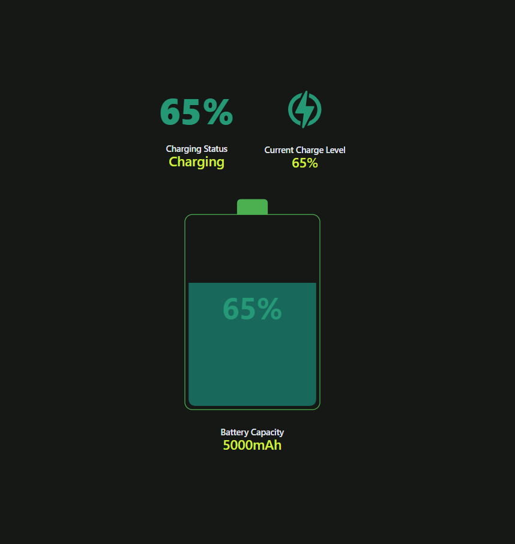
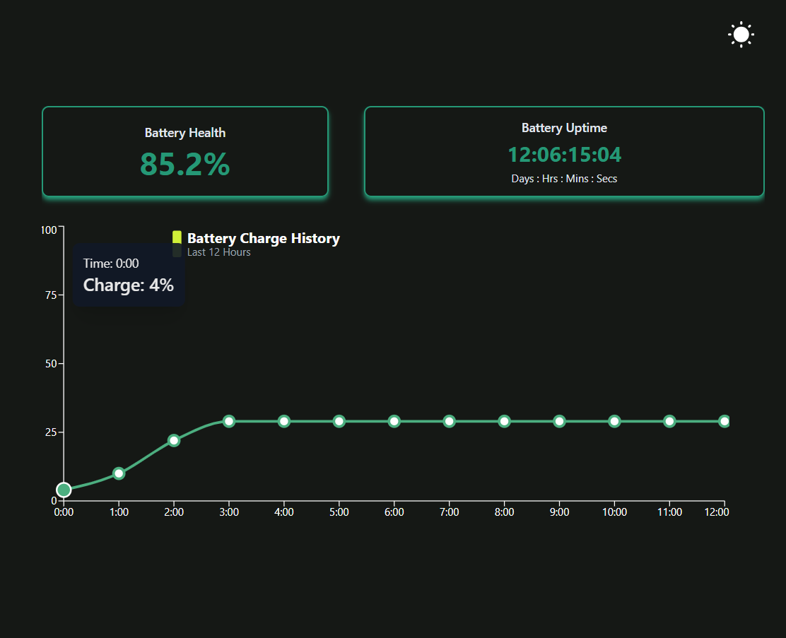

# Battery Monitoring Dashboard ⚡

A **React-based Battery Monitoring Dashboard** that provides real-time battery status, charge level, and historical data visualization using **Recharts** and **Framer Motion** for animations. It also includes **dark mode** support for better user experience.

## 🚀 Features  
- 🔋 **Battery Card** – Displays charge level and charging state.  
- 📊 **Interactive Charge History Graph** – Shows charge levels over time using **Recharts**.  
- 🌙 **Dark Mode Support** – The UI adapts dynamically using **Tailwind CSS**.  
- ⚡ **Modular & Reusable Components** – Clean, maintainable architecture.  

## 📸 Screenshots   

### Battery Status Component  
  

### Charge History Graph  
  

## 🛠️ Tech Stack  
- **React** – Component-based UI  
- **Tailwind CSS** – Styling  
- **Recharts** – Graphs & Charts  
- **Framer Motion** – Animations  
- **Context API** – State Management  

## 📂 Project Structure  

/battery-dashboard
  ├── /screenshots 📸         
  │   ├── battery_status.png
  │   ├── charge_graph.png
  ├── /src
  │   ├── /assets
  │   │   ├── /icons           
  │   │   │   ├── /batteryIcon   
  │   │   │   │   ├── BatteryIconBase.js  
  │   │   │   │   ├── BatteryIconCap.js
  │   │   │   │   ├── BatteryIconFill.js
  │   │   │   │   ├── BatteryIconOutline.js 
  │   │   │   │   ├── BatteryIconStatusText.js 
  │   │   │   ├── ChargeIcon 
  │   │   │   ├── DarkModeIcon.js    
  │   │   │   ├── LightModeIcon.js         
  │   ├── /components
  │   │   ├── /ui                 
  │   │   │   ├── Button.js
  │   ├── /context               
  │   │   ├── BatteryContext.js
  │   │   ├── ThemeContext.js
  │   ├── /features          
  │   │   ├── /components
  │   │   │   ├── BatteryCapacity.js
  │   │   │   ├── BatteryCharge.js
  │   │   │   ├── BatteryHealth.js
  │   │   │   ├── BatteryStatus.js
  │   │   │   ├── BatteryUptime.js
  │   │   ├── BatteryCard.js
  │   │   ├── BatteryDetail.js
  │   │   ├── BatteryGraph.js
  │   ├── /pages       
  │   │   ├── Dashboard.js
  │   ├── /utils       
  │   │   ├── api.js             
  │   │   ├── batteryUtils.js
  │   ├── App.js
  │   ├── index.js
  ├── package.json
  ├── README.md

## 🔧 Installation & Setup  
1. **Extract Zip File:**  
Unzip the project folder before proceeding.

Install dependencies:
npm install

Start the development server:
npm start

Open http://localhost:3000 in your browser.

🎨 Theming
Light Mode: Uses a soft background.
Dark Mode: A deep dark background.
Configured via Tailwind CSS in tailwind.config.js.# batterydashboard
